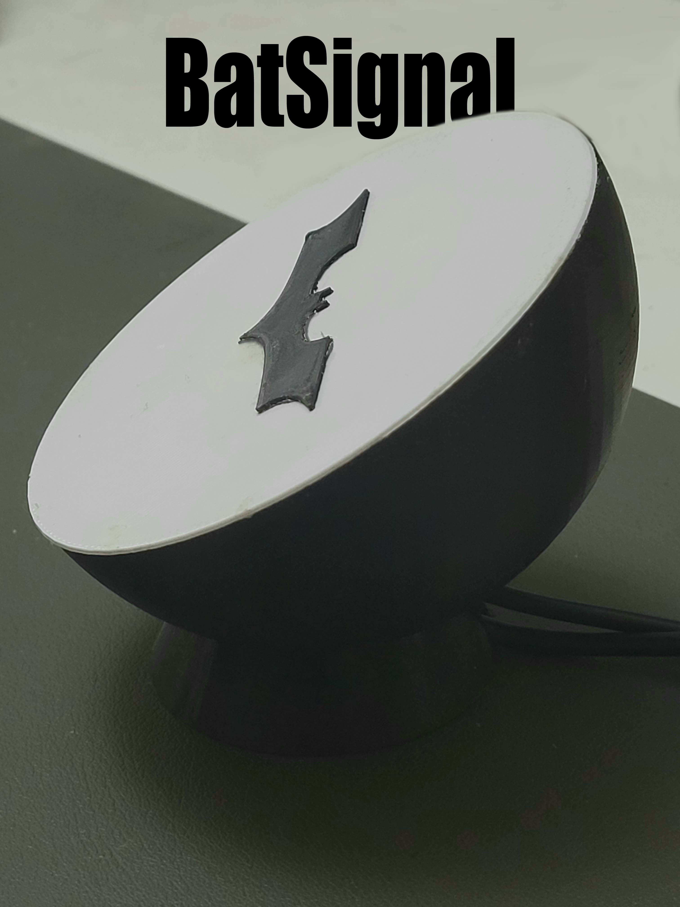
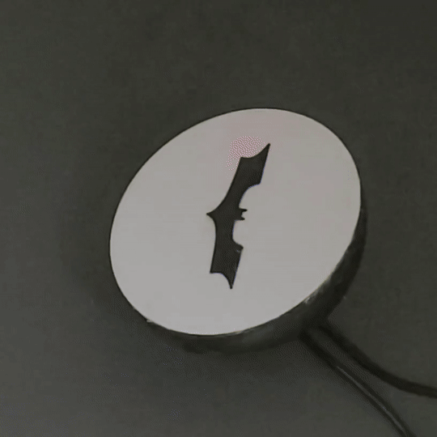
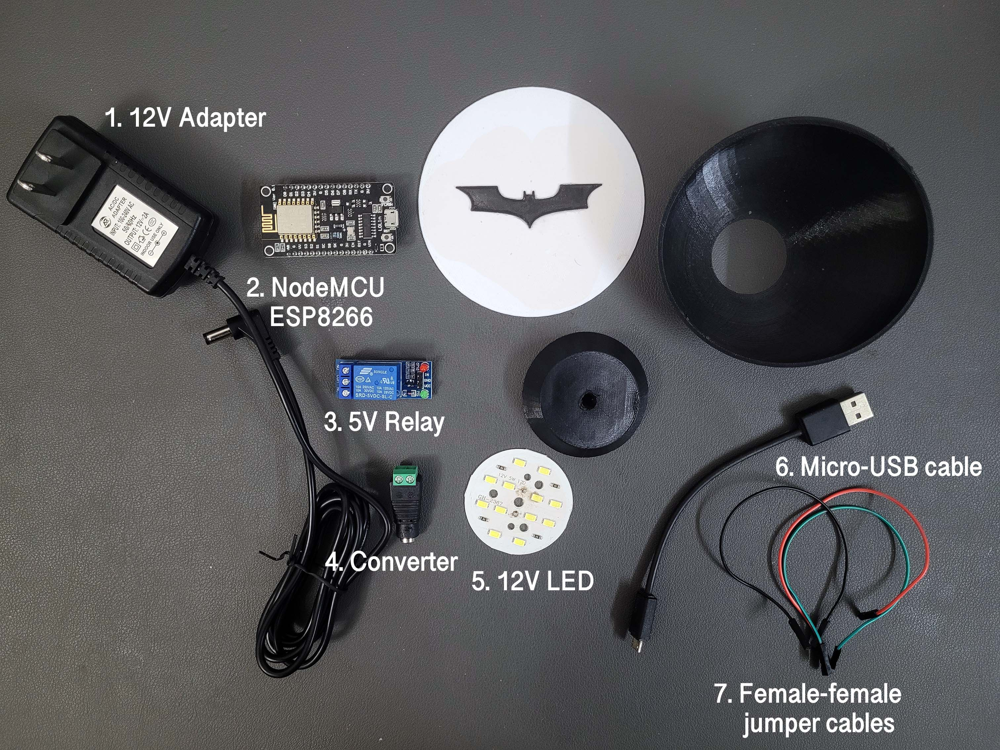

# BatSignal
This is a smart lamp which can be activated using the IFTTT smartphone app. Triggers can be set according to preferences in IFTTT which inlcude asking Google Assistant to turn it on or have it turn on when a notification is received etc. All procedures to make the device is outlined below.

# Table of contents
1. [Components](#components)
2. [3D printed enclosure](#3D-printed-enclosure)
3. [Circuit connections](#circuit-connections)
4. [Adafruit setup](#adafruit-setup)
5. [IFTTT setup](#ifttt-setup)
6. [Code](#code)

 
##  Components

1. 12V Adapter - Powers the 12V LED.
2. NodeMCU ESP8266 - Connects to internet to control the device.
3. 5V Relay - Switches LED ON/OFF based on input from NodeMCU.
4. Converter - Connects wires from LED to the 12V adapter.
5. 12V LED - Lights up when relay is in closed circuit configuration.
6. Micro-USB cable - Powers the NodeMCU ESP8266.
